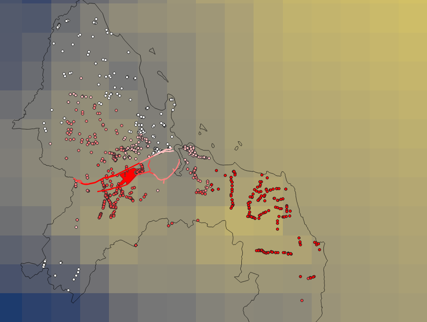
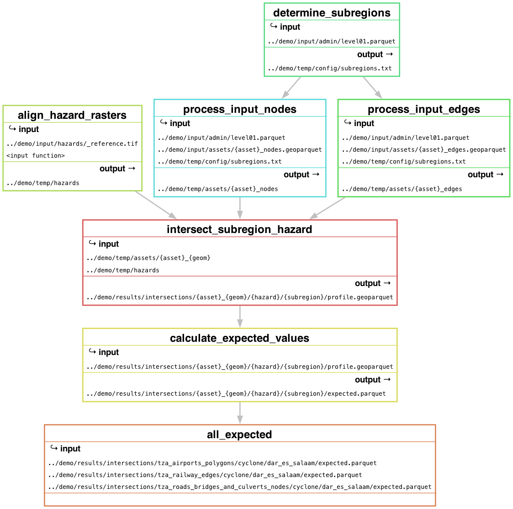

# Snakemake direct damages workflow

This is a snakemake workflow to carry out geospatial hazard–asset intersections and calculate the following asset-level risk metrics for each scenario in a portfolio of hazards:
- maximum hazard intensity per asset (length of road, area of polygon);
- units of asset damaged (exposure, m of road, m2 of polygon); and
- total rehabilitation cost of asset repair.


To keep data-management and analysis separate, the workflow has strict rules for the format of input files. These rules are documented [below](#data-formatting-rules).

When all the data is in the correct format, the [Quickstart](#quickstart) instructions describe how to run an analysis.


#### Other notes 

- This a WIP and has only been tested on Tanzania 2025.
- Minimal tests have been done, except to verify the intersection results (see rule `verify_intersections`).

## Quickstart

Data is provided for a small demo of cyclone risk to railway, airports, and bridges in Dar es Salaam, Tanzania in `demo/input`. To run it:


1. Clone this repository:
    ```bash
    git clone git@github.com:oi-analytics/direct-damages-workflow.git
    ```

1. Create and activate the conda environment:
    ```bash
    cd direct-damages-workflow
    conda env create -f environment.yaml
    conda activate oia-direct-damages
    ```

1. The demo data for cyclone hazard to Dar es Salaam, Tanzania is located in the `demo/` folder in this repository.

2. Create a file `workflow/config.yaml`, copy the contents of `demo/config.demo.yaml` to it. (Any file named `config.yaml` will be ignored by git.)

3. Run the processing, intersections, and expected damage calculations(add `-n` flag for dry run):
    
    ```bash
    cd workflow

    snakemake -c2 all_expected -n # check what will run
    snakemake -c2 all_expected    # run the analysis
    ```

4. Done 👍 You can plot the `demo/results/intersections/{asset}/cyclone/profile.geoparquet` with the hazard raster for a scenario:

    

## Workflow summary

The next snakemake filegraph shows how rules combine the input and temporary files:



You can make it like this:

```bash
snakemake --filegraph -n --until all_expected | dot -Tpng > ../demo/figs/filegraph.png
```


---

# Data formatting rules

### Config file

The `config.yaml` file is located inside the `/workflow` directory. A demo config file is provided in `demo/` for a Dar es Salaam case example.

Example `config.yaml` for the [OIA/WBG Tanzania 2025 project](https://github.com/oi-analytics/tanzania-transport-resilience) with links to the shared Teams drive:

```yaml
input: "/Users/alison/Library/CloudStorage/OneDrive-SharedLibraries-OxfordInfrastructureAnalyticsLimited/WBG Tanzania transport resilience - Project/4 Data/snakemake/input"
temp: "/Users/alison/Library/CloudStorage/OneDrive-SharedLibraries-OxfordInfrastructureAnalyticsLimited/WBG Tanzania transport resilience - Project/4 Data/snakemake/temp"
results: "/Users/alison/Library/CloudStorage/OneDrive-SharedLibraries-OxfordInfrastructureAnalyticsLimited/WBG Tanzania transport resilience - Project/4 Data/snakemake/results"
figs: "/Users/alison/Library/CloudStorage/OneDrive-SharedLibraries-OxfordInfrastructureAnalyticsLimited/WBG Tanzania transport resilience - Project/4 Data/snakemake/figs"
local_crs: 32735
country: "tanzania"
admin_level: "01"
bbox: [29, 41, -12, -1]
asset_geoms:
  - "tza_roads_edges"
  - "tza_roads_bridges_and_culverts_nodes"
  - "tza_railway_edges"
  - "tza_airports_polygons"
  - "tza_iww_ports_polygons"
  - "tza_maritime_ports_polygons"
hazards:
  - "fluvial"
  - "pluvial"
  - "coastal"
  - "cyclone"
  - "landslide"
  - "hd35"
  - "tasmax"
```

### Administrative boundaries data

Store administrative boundary polygons for a giving administrative level (*e.g.*, 01, 02, 03) in `{config.input}/admin/` with the filename: `level{level}.geoparquet`. 

Metadata such as data source, resolution, date, etc. should be recorded separately.

### Assets

Assets should be placed in `{config.input}/assets/` with format:
```
{iso}_{asset}_{geom}.geoparquet
```

where:
- `iso` is the iso code for the region of study, e.g., `tza` for Tanzania, or `nga` for Nigeria.
- `asset`: asset type (e.g., `airports`, `railway`)
- `geom`: geometry type (e.g., `nodes`, `edges`, `polygons`)
- every file has as `asset_type` field that links entires to the csv files in [Management data](#management-data)

Rules in `rules/assets.smk` pre-process asset data to:
- Split by subregion in `{config.input}/admin/level{level}.geoparquet`.
- Contain only a single geometry type per asset (e.g., LineString, Polygon, Point—no MultiLineStrings)
- Have WGS-84 projection
- Have five columns: `id`, `asset_type`, `unit`, `unit_type`, `geometry`.

Processed assets are saved to `{config.temp}/assets/` with format: `{asset}_{geom}/{subregion}.geoparquet`.

### Hazards

Hazard rasters should be placed in `{config.input}/hazards/` with format:

```
{hazard}_{epoch}_{scenario}_rp{rp}.tif
```
- `hazard`: hazard name (e.g., `pluvial`, `cyclone`). Should match the hazard used in damage curves and rehabilitation costs
- `epoch`: time horizon (e.g., `2020`, `2050`, `2080`)
- `scenario`: climate scenario (e.g., `historical`, `ssp245`, `ssp585`)
- `rp`: return period (e.g., `00010`, `00050`, `00100`)

Hazard rasters should have WGS-84 projection and proper `NoData` values defined. Examples of preparing e.g., Fathom data will be put in the 2025 Tanzania project repo. Preprocessing and assumptions should be done *before* adding rasters to `{config.input}/hazards/` and recorded separately.

The rules in `rules/hazards.smk` align all the rasters to a common grid and save them to `{config.temp}/hazards/`. A reference file `_reference.tif` with the desired grid should be placed in `{config.input}/hazards/`.

### Physical vulnerability and management data

The workflow uses damage curves, design standards, and rehabilitation costs stored in `{config.input}/config/damage_curves/`, `{config.input}/config/design_standards/`, and `{config.input}/config/rehab_costs/`:

| Data type            | Format | Location                                           |
|----------------------|--------|----------------------------------------------------|
| Damage curves        | CSV    | `config/damage_curves/{hazard}/{asset_type}.csv`   |
| Design standards     | CSV    | `config/design_standards/{hazard}.csv`             |
| Rehabilitation costs | CSV    | `config/rehab_costs/{hazard}.csv`                  |

Rehabilitation costs and design standards are indexed by `asset_type`.

Damage curves have an `intensity` column and three columns for damage fractions: `damage_fraction_max`, `damage_fraction_min`, `damage_fraction_mean`. Use `#` to note the units of intensity. Costs are specified in `costs_per_unit` with a separate `unit_type` column indicating `m` (LineStrings), `sqm` (Polygons), or `unit` (Points). Example processing scripts to get input costs and curves into the right format are in `analysis/scripts/` [check this link has probably changed].

See examples in `demo/` directory.

### Intersection results

For each hazard type, asset, and subregion, you get two files:

- `profile.geoparquet`: the risk metrics costs for all return periods and scenarios.
- `expected.parquet` (previously `annual.parquet): the expected annual values of the risk metrics.

The risk metrics are:

| Metric | Description | Split aggregation |
| ------ | ----------- | ----------------- |
| `hazard` | Raw hazard intensity | Max |
| `defended` | Net hazard intensity | Max |
| `damage` | Extent of damaged (units/m/sqm) | Sum |
| `cost` | Repair costs of damaged units | Sum |

Repair cost is calculated as [ total rehabilitation cost of asset ] $\times$ [ fraction of asset damaged ].

For line geometries. There the option to output `splits.geoparquet` this returns the metrics above for the vector data, split over the raster grid.

## Data directory structure

### Before running workflow

```
.
├── admin
│   └── level{level}.parquet
├── assets
│   └── {iso}_{asset}_{geom}.geoparquet
├── config
│   ├── damage_curves
│   │   └── {hazard}
│   │       └── {asset_type}.csv
│   ├── design_standards
│   │   └── {hazard}.csv
│   ├── rehab_costs
│   │   └── {hazard}.csv
│   └── subregions.txt
└── hazards
    ├── _reference.tif
    └── {hazard}_{epoch}_{scenario}_rp{rp}.tif
```

### After running workflow

```
├── config.demo.yaml
├── figs/
├── input
│   ├── admin
│   │   └── level01.geoparquet
│   ├── assets
│   │   └── {iso}_{asset}_{geom}.geoparquet
│   ├── config
│   │   ├── damage_curves
│   │   │   └── {hazard}
│   │   │       └── {asset_type}.csv
│   │   ├── design_standards
│   │   │   └── {hazard}.csv
│   │   └── rehab_costs
│   │       └── {hazard}.csv
│   └── hazards
│       ├── _reference.tif
│       └── {hazard}_{epoch}_{scenario}_rp{rp}.tif
├── results
│   ├── flags/
│   └── intersections
│       └── {iso}_{asset}_{geom}
│           └── {hazard}
│               └── {subregion}
│                   ├── expected.parquet
│                   └── profile.geoparquet
└── temp
    ├── assets
    │   └── {iso}_{asset}_{geom}
    │       └── {subregion}.geoparquet
    ├── config
    │   └── subregions.txt
    └── hazards
        ├── _reference.tif
        └── {hazard}_{epoch}_{scenario}_rp{rp}.tif

```

## To do

### Documentation

- [ ] Document the `exactextract` for polygons and add more damage metric functions.
- [ ] Better figures
- [ ] Make the "splits" options clearer
- [ ] Section on intersections and outputs

### New features

- [ ] Code to spatially aggregate and finalise outputs into pivot tables
- [ ] Code to make deliverable pivot tables of results
- [ ] Option to interpolate to design standards
- [ ] (Optional) Add scripts for figures
- [ ] Consider saving only nonzeros? R does this but unsure if to keep track of missing data vs true zeros.
- [ ] More investigation Simpson vs trapezoidal rule for expected value calculations
- [ ] Verify intersections.linestrings.unsplit() index matching logic
- [ ] Benchmarking and complexity
- [x] Separate hazard pre-processing into its own workflow
